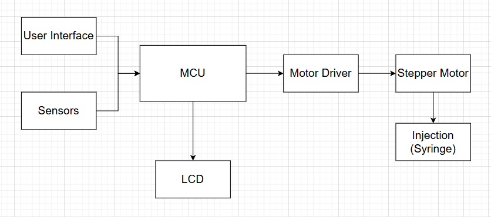
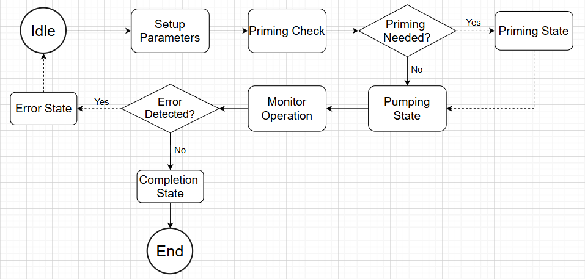

# Assignment-Project
# Syringe Pump Project

## Introduction
The Syringe Pump Project involves designing and developing a system that accurately dispenses fluids using a syringe. The project aims to understand the mechanics of fluid dispensing, control systems, and safety checks in automated systems.

## Flow Chart

## Block Diagram

## State Diagram

## Project Details
- **Components Used**: Microcontroller, Stepper Motor, Motor Driver, Sensors, LCD (optional)
- **Key Features**:
  - User interface for parameter input.
  - Error detection and handling.
  - Real-time monitoring during operation.
- **Goals**:
  - Ensure accurate fluid dispensing.

## Acknowledgements
This project was done as part of a university group assignment to understand and build an automated fluid dispensing system.
