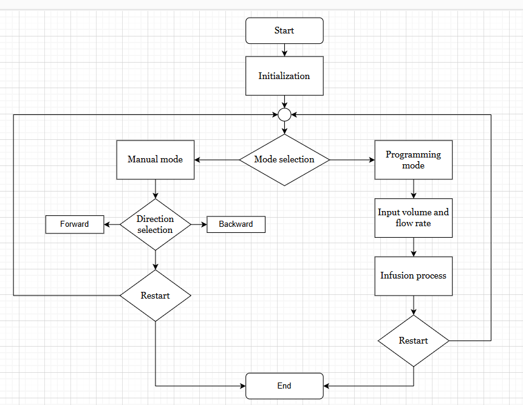

# Assignment-Project
# Syringe Pump Project

## Introduction
The Syringe Pump Project involves designing and developing a system that accurately dispenses fluids using a syringe. The project aims to understand the mechanics of fluid dispensing, control systems, and safety checks in automated systems.

## Flow Chart

## Block Diagram

## State Diagram

## Acknowledgements
This project was done as part of a university group assignment to understand and build an automated fluid dispensing system.
